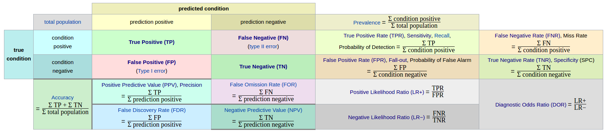

# 模型评估与选择

通过算法学习，我们可以得到数据的模型，但我们应该怎么评估这个模型好坏，怎么与其他模型比较？

## 1.误差与拟合

`错误率 error rate`：分类错误的样本数占总样本的比例。

`精度 accuracy`： 1-错误率。

`误差 error`：更一般的、实际预测输出与真实输出之间的差异 。

`训练误差 training error` 、`经验误差 empirical error`：在训练集上的误差。

`泛化误差 generalization`：在新样本上的误差。

> 毫无疑问，我们的目标当然是使*泛化误差*尽可能小。但我们并不知道新样本会是什么~~(如果知道就用来训练了)~~,因此实际中我们只能尽可能的使训练误差减小。

`过拟合 overfitting`： 在训练集上表现很好，但在实际使用中泛化性能不佳。

`欠拟合 underfitting` : 连训练集上都未学习好。

> 欠拟合是比较容易克服的，多训练几轮就可以了。
>
> 但过拟合却十分麻烦！机器学习的问题往往是NP难问题，简单的说就是无法在多项式时间内获得最优解，只能获得一个近似、局部最优解。这个解会尽量使训练误差最小，这就会导致模型过度的学习训练样本，将样本的一些自身特点当做了一般特性，这就导致了过拟合。因为无法获得全局最优解，因此过拟合是无法避免的！


## 2.评估方法

从上面对过拟合的分析我们知道光看训练误差是没有什么意义的，我们需要知道泛化误差,来帮助我们进行**模型选择(model selection)**和**调参(parameter tuning)**。为了能够评估泛化误差，我们需要一个**测试集(training set)**来模拟新样本。那么这个测试集从哪里来？

:smile: 为了与实际遇到的真实测试数据进行区别，测试集常被称为**验证集（validation set）** 。


####  留出法 hold-out

简单暴力，直接将数据集划分为两个互斥的集合，一个作为训练集，一个作为测试集。

> 注意一：划分时要尽可能保持数据分布的一致性，可以使用*分层采样（stratified sampling）*的方式。
>
> 注意二：由于存在多种划分方式，因此一般进行多次随机划分然后对每次结果取平均值。
>
> 注意三：测试集小，会导致评估结果方差较大（过拟合）；训练集小，会导致评估结果偏差较大（欠拟合）。一般将2/3~4/5的数据作为训练集，而测试集一般至少应含30个样例。


#### 交叉验证 cross validation

将数据集划分为K个大小相似的互斥子集。每个子集尽量保持数据发布的一致性（分层抽样）。然后每次用K-1个子集作为训练集，剩下那个子集作为测试集，这样就可以进行K次训练和测试，最后返回均值。

> 因为分为 K个，因此又称为“K折交叉验证”、“K倍交叉验证”。K一般取10左右。
>
> 当K取样本大小时，则称为:留一法（Leave-One-Out,LOO）,这种评估结果往往认为比较准确，但是计算开销实在太大。

又由于存在多种划分方式，因此通常要随机使用不同的划分方式重复P次，最终结果为这p次K折交叉验证结果的均值。


#### 自助法（可重复采样、有放回采样） bootstrapping

> 上面的两种方法，都会导致训练集小于数据集，这会产生评估偏差，而自助法能够解决这个问题。

自助法以*自助采样法*为基础。给定包含m个样本的数据集D，采用生成数据集D‘：每次从D中随机取一个样本放入D’，并放回D，使D始终不变。重复m次后，就会获得包含m个样本的数据集D‘。我们可以估计一下D中未被采样到的样本数：（1-1/m）^m取极限约为0.368。这意味着有36.8%的数据未被采样到。于是我们将D’作为训练样本，D\D'作为测试样本，这样我们的训练集大小任为m，在这方面不会引入评估偏差。

> **注意！**自助法在数据集较小，难以有效划分训练\测试集时很有用。
>
> 但当数据集足够大时，留出法和交叉验证法更常用。因为自助法会改变数据集发布，也会引入偏差。


## 3.性能度量

在上面评估方法中对于数据集的度量使用的是泛化误差。但在实际使用中只使用泛化误差往往是不够的，我们需要更为全面的性能度量标准。


####3.1混淆矩阵(confusion matrix)



True、False:预测的结果是否正确               Positive、Negative：预测的结果

> 混淆矩阵通过不同的组合可以形成这种参数指标

**1.正确率 precision**

$Precision=\frac{TP}{TP+FP}$

**2.真阳性率(True Positive Rate TPR),灵敏度(Sensitivity),召回率(Recall)**

$Sensitivity=Recall=TPR=\frac{TP}{TP+FN}$

**3.真阴性率(True Negative Rate TNR),特异度(Specificity)**

$Specificity=TNR=\frac{TN}{FP+TN}$

**4.假阴性(False Negative Rate FNR),漏诊率**

$FNR=\frac{FN}{TP+FN}$

**5.假阳性(False Positive Rate FPR),误诊率**

$FPR=\frac{FP}{FP+TN}$

**6.阳性似然比(Positive Likelihood Ratio LR+)**

$LR+ =\frac{TPR}{FPR}=\frac{Sensitivity}{1-Specificity}$

**7.阴性似然比(Negative Likelihood Ratio LR-)**

$LR- =\frac{FNR}{TNR}=\frac{1-Sensitivity}{Specificity}$

**8.Youden 指数 **

$Youden index=Sensitivity+Specificity-1=TPR-FPR$

---

#### 3.2查准率(Precision),召回率(Recall),F值

> P值，R值，F值可以说是最为常用的指标了

$P=\frac{TP}{TP+FP}$        $ R=\frac{TP}{TP+FN}$       $F_\beta=\frac{(1+\beta^2)*P*R}{(\beta^2*P)+R} (\beta>0)$

**P值：**预测为真的结果中，预测正确的概率。

**R值：**正真为真的数据，成功预测的概率。

> 我们的目标当然是P值和R值越高越好，但是这两者却是矛盾的。
>
> 高R低P：宁可错杀不可放过，~~只要它是那我一定说是~~ 。比如对于癌症的预测宁可误差也不能漏诊。
>
> 高P低R：宁可放过不可错杀，~~我说他是那他就是~~。比如人道主义的判断坏人，只要判断是坏人那就一定是。

但是到底应该怎么取P,R值的大小，实在麻烦，于是就有了F值。

**F值：** 参数=1   F1为P和R的调和平均数，两者一样重要。

​           参数<1   侧重于R值

​           参数>1   侧重于P值

> 但是有时候我们会有多个混淆矩阵，比如进行了多次训练/测试。这时候我们只要对P,R,F值稍加修改就行了。

**宏 macro:** 先求出各个P,R值。然后求平均P,R值。最后求F值。

$macro-P=\frac{1}{n}\sum\limits_{i=1}^{n} P_i$		$macro-R=\frac{1}{n}\sum\limits_{i=1}^{n} R_i$	        $macro-F_1=\frac{2*macro-P*MACRO-R}{macro-P+macro-R}$

**微 micro：**先求平均再求P,R,F

$micro-P=\frac{\overline{TP}}{\overline{TP}+\overline{FP}}$			$micro-R=\frac{\overline{TP}}{\overline{TP}+\overline{FN}}$			$micro-F_1=\frac{2*micro-P*micro-R}{micro-P+micro-R}$

---

#### 3.3ROC与AUC

> **多用于度量分类算法。**
>
> **优势：**当测试集中的正负样本的分布变化的时候，ROC曲线能够保持不变(P-R曲线会变化明显)。
>
> 在实际的数据集中经常会出现类不平衡(class imbalance)现象，即负样本比正样本多很多(或者相反)，而且测试数据中的正负样本的分布也可能随着时间变化。 


**ROC**(Receiver Operating Characteristic)反映敏感性和特异性连续变量的综合指标，曲线上每个点反映着对同一信号刺激的感受性。


**横轴：** 假阳性 $FPR=\frac{FP}{FP+TN}$   预测为正但实际为负的样本占所有负例样本的比例

**纵轴：** 真阳性  $TPR=\frac{TP}{TP+FN}$   预测为正且实际为正的样本占所有正例样本 的比例

对于分类器，改变最后的分类阈值，就可以获得不同大小的FPR和TPR，用于画出ROC图。

> **理想目标：**TPR=1，FPR=0，即图中(0,1)点，故ROC曲线越靠拢(0,1)点越好。
>
> 但是往往并不能很好的判断出，两个ROC图，哪个更好，更接近(0,1)点。
>
> 于是便有了AUC。


**AUC** (Area under the curve)为ROC曲线下的面积，显然这个面积的数值不会大于1。又由于ROC曲线一般都处于y=x这条直线的上方，所以AUC的取值范围一般在0.5和1之间(小于0.5那么这个分类器还不如投硬币......)。**AUC值越大的分类器，正确率越高**。

对于AUC的计算有多种方法([参考](https://blog.csdn.net/qq_22238533/article/details/78666436))：

1.直接计算,知道坐标{(x1,y1),(x2,y2)......(xm,ym)}

$AUC=\frac{1}{2}\sum\limits_{i=1}^{m-1}(x_i+1-x_i)*(y_i+y_{i+1})$

2.在有M个正样本,N个负样本的数据集里。一共有M*N对样本（一对样本即，一个正样本与一个负样本）。统计这M*N对样本里，正样本的预测概率大于负样本的预测概率的个数。**注意：这个“预测概率”不一定是真的概率，只要能比大小即可**

$AUC=\frac{\sum{I(P_{正样本}，P_{负样本})}}{M*N}$          $I(P_{正样本}，P_{负样本})=\left\{    \begin{array}{ll}        1 &\mbox{P_正样本>P_负样本}\\        0.5 &\mbox{P_正样本=P_负样本} \\    0 &\mbox{P_正样本<P_负样本}  \end{array}    \right.$

比如现在有2个正例和两个反例：


| ID   | label | pro  |
| ---- | ----- | ---- |
| A    | 0     | 0.1  |
| B    | 0     | 0.4  |
| C    | 1     | 0.4  |
| D    | 1     | 0.8  |

共4种组合：{C,A},{C,B},{D,A},{D,B}.            

结果为：$AUC=\frac{1+1+1+0.5}{4}=0.875$


3.用rank法,M个正样本,N个负样本.按照概率排个序，然后将正例的序号相加(重叠取平均)，减去常数项，除以常数项即可。

$AUC=\frac{\sum_{ins_i\in{positiveclass}}rank_ins_i-\frac{M*(M+1)}{2}}{M*N}$

如：
| ID   | label | pro  | rank |
| ---- | ----- | ---- | ---- |
| A    | 0     | 0.1  | 1    |
| B    | 0     | 0.4  | 2    |
| C    | 1     | 0.4  | 3    |
| D    | 1     | 0.8  | 4    |


结果：$AUC=\frac{4+(2+3)/2-2*(2+1)/2}{2*2}=0.875$


4.实际使用时直接用别人的实现~

```python
import numpy as np
from sklearn.metrics import roc_auc_score
y_true = np.array([0,0,1,1])
y_scores = np.array([0.1,0.4,0.4,0.8])
print "y_true is ",y_true
print "y_scores is ",y_scores
print "AUC is",roc_auc_score(y_true, y_scores)
```


#### 3.4 代价敏感错误率与代价曲线

该方法对FN和FP分配了一个代价，~~:cry:具体就不做了解了~~


## 4 比较检验

照理来说，我们已经学会了评估方法和性能度量，我们应该能够愉快的进行对学习器的优劣比较了。但现实并不像这样简单。对此西瓜书给出了三个因素：

> 1.我们得到的只是测试集上的性能度量并不能等同于正真的泛化性能。

>2.测试集的选择会对结果带来很大的影响。

> 3.算法本身就有一定的随机性，即使参数相同也会得出不同的结果。

那么我们应该怎么办？（接下来为了方便以错误率ε为例）


**首先，我的求得的这个测试样本错误率ε还有没有用？**

当然有用，**统计假设检验（hypothesis test）**为我们提供了重要依据。

``假设检验的定义是：在总体的分布函数完全未知或已知其形式，但不知其参数的情况，为了推断总体的某些未知特性，提出某些关于总体的假设。我们要根据样本对所提出的假设作出是接受还是拒绝的决策。``

也就是说，我们已经得到了假设，我们需要做的是知道对于这个假设，我们接受的概率是多少，拒绝的概率是多少。很明显当然是接受的概率越高越好，这样才能用我们的这个假设去近似正真情况啊。


**那么问题又来了，这个接受概率怎么求？**

为此，我们又要推出两个概念：**置信度（confidence）=1-α**  和  **置信区间**

> 比如，在置信度0.95上的置信区间X。意味着真实值落在X上的概率为95%

我们一般都是确定置信度，然后求出相应的置信区间，也就是说我们得将错误率ε变换为一个范围表示。


**那么我们的任务变成了怎么将一个数值变成一个范围，并且还要考虑其发生概率？**

为此这里将讲述几种西瓜书里提到的检验方法。

#### 4.1 二项检验 binomial test

> **使用场景：单个学习器，只有一个单独的错误率ε**


在测试样本m独立采样的条件下，我们可以求出，泛化错误率为ε的学习器被测出测试错误率为ε‘的概率是多少。

$P(\epsilon';\epsilon)=\epsilon^{\epsilon'*m}(1-\epsilon)^{m-\epsilon'*m}$

很明显的，当ε=ε‘时，概率是最大的，而且还符合二项发布。

这时我们假设ε<=ε0,并设置置信度1-α。我们可以求出在这个条件下，测试错误率ε‘。

$\epsilon'=(max \epsilon) s.t (\sum\limits_{i=\epsilon0*m+1}^{m}\epsilon^i(1-\epsilon)^{m-i})<\alpha (s.t 是 subject to 的缩写，使左边式子在右边条件满足时成立)$

他直接理解就是：在ε0确定的情况下，寻找一个最大的满足右边式子的ε即为ε’。

通俗一点理解就是：因为ε是小于ε0的，因此当误分样本数大于(ε0+m)是不可能的。而我们测出的ε‘满足二项发布，是可能出现误分样本大于(ε0+m)的情况的，于是我们要限制这个情况出现的概率小于某个值α。

实际使用时：我们已经知道了ε’，可以反过来求出当等于α时，相应的ε0为多少。

这样就实现了从一个单独的测试错误率ε‘，转换为一个范围的泛化错误率ε。


#### 4.2 t检验 t-tets

> **使用场景：单个学习器，有多个错误率的值**


> **先了解一下什么是t发布：**

**学生t-分布**（Student's *t*-distribution）可简称为**t分布**：$T=\frac{\overline{X_n}-\mu}{S_n/\sqrt{n}}=\frac{样本均值-整体期望}{样本标准差/\sqrt{样本数}}=n-1自由度的t分布$

> T分布，是一种正太分布的近似分布，当自由度趋于无穷时，即为标准正太分布。那为什么不用正太分布呢？因为我们往往得不到正真数据样本的期望和方差，用不了正太，只能用样本的标准差和期望来构建T分布。
>
> 所以，**T分布用于根据小样本来估计呈正态分布且方差未知的总体的均值。如果总体方差已知（例如在样本数量足够多时），则应该用正态分布来估计总体均值。**


好，那么现在假设我们得到了K个测试错误率，ε1‘，ε2’……εk'。于是有：

$测试错误率：\mu=\frac{1}{k}\sum\limits_{i=1}^{k}\epsilon_i^{'}$        $测试方差：\sigma^2=\frac{1}{k-1}\sum\limits_{i=1}^k(\epsilon_i^{'}-\mu)^2$    

则 $\tau_t=\frac{\sqrt{k}(\mu-\epsilon_0)}{\sigma}$ 满足自由度为k-1的t发布。ε0为泛化错误率。

> 这个时候我们又要用到置信度1-α了。对于t分布，使用**双边（two-tailed）**假设，即图中阴影部分的面积和为α且左右平分。

那么我们就能根据k和α，得到左右临界值，进而得出ε0的置信区间。（这个临界值可以通过查表或函数得到）


#### 4,3交叉验证t检验

> **使用场景：两个学习器，通过交叉验证法得到多个测试错误率**

**成对t检验（paired t-tests）：**

假设我们已经通过k折交叉验证法得到学习器A和B的错误率为{εA1，εA2……εAk}{εB1,εB2……εBk}。那么可以得到每对结果的差Δi=εAi-εBi。于是我们对“学习器A和B性能相同”这个假设做t检验，求出Δ的均值和方差。如果在显著度α下，变量$\tau_t=|\frac{\sqrt{k}\mu}{\sigma}|$ 小于临界值t_α/2,k-1，那么就说明两个学习器没有显著差别，否则认为平均错误率小的那个学习器性能较优。(这里相当于检查期望为0是否落在置信区间内。)

**5*2交叉验证：**

假设检验的一个重要前提是测试错误率均为泛化错误率的独立采样。但是由于样本有限，交叉验证时不同轮次的训练集会有一定程度的重叠，这使得测试错误率并不独立，会导致过高估计假设成立的概率。而5*2交叉验证法可以缓解这个问题。

5*2交叉验证是指做5次2折交叉验证。每次2折交叉验证前都要随机打乱数据。那么在每次交叉验证后都会得到两队测试错误率，同样的对他们求差Δ1i,Δ2i。于是可以得到：

$\mu=0.5(\Delta_1^1+\Delta^2_1)$  为缓解测试错误率的非独立性，仅用第一次的结果求平均值。

$\sigma^2_i=(\Delta^1_i-\mu)^2+(\Delta^2_i-\mu)^2$

则变量$\tau_t=\frac{\mu}{\sqrt{0.2\sum\limits_{i=1}^{5}\sigma^2_i}}$   服从自由度为5的t分布，其双边检验的临界值当α=0.05时为2.5706，α=0.1时为2.0150

#### 4.4McNemar检验

> **使用场景：两个学习器，分类问题**

McNemar检验使用了卡方检验，那么先让我们了解一下什么卡方分布。

> **卡方分布，$\chi^2$分布：**若n个相互独立的随机变量ξ₁、ξ₂、……、ξn ，均服从标准正态分布，则这n个服从标准正态分布的随机变量的平方和$\chi=\sum\limits_{i=1}^{k}\xi_i^2$服从卡方分布（chi-square distribution）。k为卡方分布的自由度，当自由度趋于无穷大时，卡方分布变为正态分布。
>
> **其根本思想就是在于比较理论频数和实际频数的吻合程度或拟合优度问题。**
>
> **个人通俗的理解卡方分布：如果两个东西相似，那么他们的一些属性值肯定是很接近的，这些值的差除以期望值理论上为0(且符合标准正态分布)。然后为了综合评估一下这些值的结果是否都趋于0，于是就求了一下这些理论上应该为0的结果的平方和，这个平方和当然越小越好但是具体要小到什么程度比较好呢？于是就有了卡方分布，这个分布只与自由度（自由度取决于值的数量=(行-1)*(列-1)）有关，因为很明显的自由度越高平方和会越大。然后再加入一个置信值的概念。于是平方和只要小于相应自由度和置信值的卡方分布的临界值，那么就认为两者是相似的！**

对于二分类问题，我们可以得到两个分类器的差别列列表

| 算法B\算法A | 正确   | 错误   |
| ------- | ---- | ---- |
| 正确      | e00  | e01  |
| 错误      | e10  | e11  |

若我们假设两个学习器性能相同，那么有e01=e10，那么变量|e01-e10|服从正态分布。

那么变量$\tau_{x^2}=\frac{(|e_{01}-e_{10}|-1)^2}{e_{01}+e_{10}}$ 服从自由度为1的卡方分布。


卡方分布检验是单尾检验且是右尾，右尾被作为拒绝域。于是通过查看检验统计量是否位于右尾的拒绝域以内，来判定期望分布得出结果的可能性。

那么我们只要比较一下，如果$\tau_{x^2}$小于临界值$\chi^2_\alpha$ 那么两个分类器没有显著差别，不然认为错误率小的那个学习器性能较优。

**ps：**对于卡方分布我觉得[这篇文章讲的不错](https://www.cnblogs.com/think-and-do/p/6509239.html) 。


#### 4.5Friedman检验和Nemenyi检验

> **使用场景：多个学习器，多个算法**

对于多个学习器我们可以用McNemar进行两两比对，也可以用基于算法排序的Friedman检验直接得到。

具体实现没有仔细研究，只了解个大概。


从图中可以直观看出，纵轴为各个算法，横轴为平均序值。每个算法的原点显示其平均序值，横线为临界值域。只要两个算法有相交部分就说明两者没有明显差异。于是先用Friedman检验看是否所有的算法都没有显著差异，如果不是那么用后续检验如Nemenyi后续检验来进一步区分各个算法。


## 5.偏差与方差

“偏差-方差分解(bias-variance decomposition)”是解释学习算法泛化性能的一种重要工具。

> **偏差（bias）:度量了学习算法的期望预测与真实结果的偏离程度，即算法拟合能力。**

> **方差（variance）:度量了同样大小的训练集的变动所导致的学习性能的变化，即算法过拟合能力**

> **噪声：表达了在当前任务上任何学习算法所能达到的期望泛化误差下界，即问题本身的难度**

> **泛化误差=偏差+方差+噪声**   对于一个问题我们无法左右噪声大小，我们只能使偏差和方差尽可能小，但是由于存在偏差-方差窘境，我们难以兼顾方差和偏差。


**如果某人说这个算法**

​     **是高偏差的，那就是欠拟合，是高方差的，那就是过拟合**

